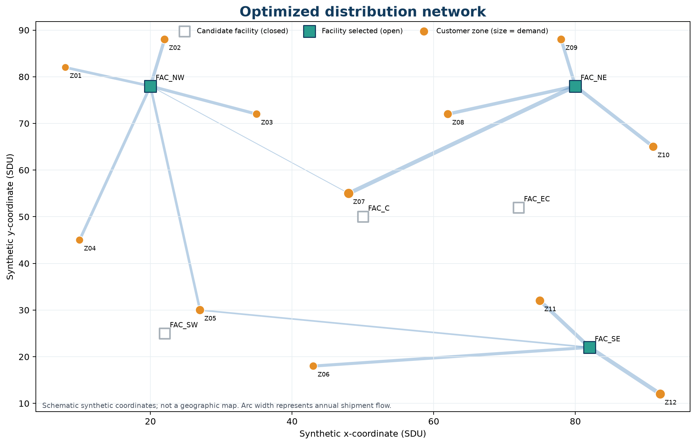
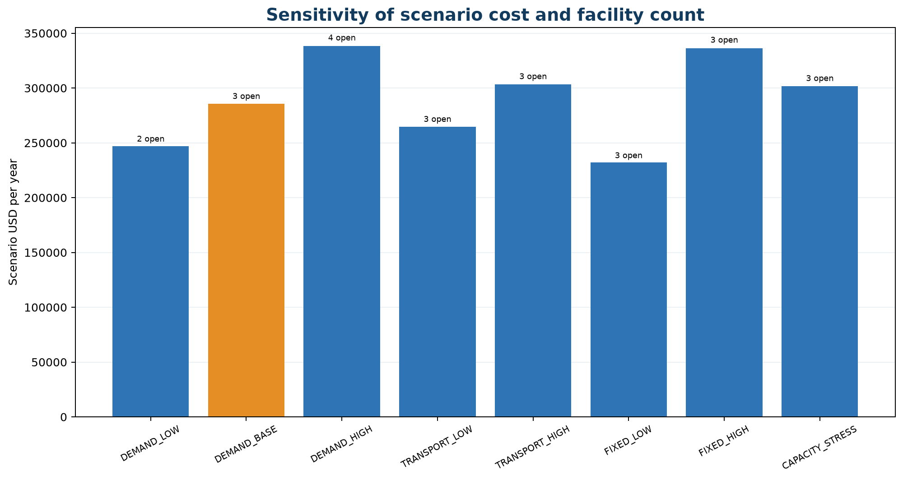

# Pyomo Supply Chain Network Optimization

A clean-room, scenario-based optimization case study inspired by graduate optimization coursework and historical Pyomo experimentation. The project demonstrates how a mixed-integer linear program can select distribution facilities and allocate customer shipments while making solver status, units, assumptions, and validation evidence inspectable.

This is a synthetic portfolio case—not a real company model, an operating recommendation, or evidence of realized logistics savings.

## Overview

The model combines two decision layers:

1. binary strategic decisions choose which candidate facilities open;
2. continuous shipment decisions allocate annual customer demand across the open network.

The implementation demonstrates MILP formulation, facility location, network allocation, exact demand balance, capacity activation, scenario-cost optimization, Pyomo, HiGHS, solver-status handling, independent objective and feasibility checks, exhaustive small-case enumeration, sensitivity analysis, and reproducible Python workflows.

## Executive results

| Metric | Validated value |
|---|---:|
| Selected facilities | `FAC_NW`, `FAC_NE`, `FAC_SE` |
| Objective | 285,488.90 scenario USD/year |
| Fixed cost | 214,000.00 scenario USD/year |
| Transport cost | 71,488.90 scenario USD/year |
| Selected capacity | 990 units/year |
| Selected flow | 960 units/year |
| Selected-network utilization | 96.9697% |
| All-facilities-open reference objective | 494,015.05 scenario USD/year |
| Scenario difference from reference | 208,526.15 lower (42.210485%) |
| Feasible enumerated subsets | 41 of 64 |
| Solver status | `ok` |
| Termination condition | `optimal` |
| Reported MIP gap | 0.0 |

## Case definition

The deterministic annual scenario contains six candidate distribution facilities, twelve customer zones, and all 72 possible facility-customer arcs. It decides which facilities to open and how much each selected facility ships to each customer.

The model has 72 nonnegative shipment variables, six binary facility-opening variables, twelve exact demand-balance constraints, and six facility capacity/activation constraints.

## Mathematical formulation

For facilities \(i\in F\) and customers \(j\in C\), the model minimizes:

\[
\sum_{i\in F} f_i y_i + \sum_{i\in F}\sum_{j\in C} c_{ij}x_{ij}
\]

subject to exact customer demand balance, facility capacity linked to the open decision, nonnegative shipment flows, and binary facility decisions:

\[
\sum_i x_{ij}=d_j, \qquad
\sum_j x_{ij}\le K_i y_i, \qquad
x_{ij}\ge0, \qquad y_i\in\{0,1\}.
\]

See [docs/mathematical_formulation.md](docs/mathematical_formulation.md) and [docs/unit_conventions.md](docs/unit_conventions.md).

## Scenario data

All facility, customer, coordinate, demand, capacity, fixed-cost, and distance-rate values are transparent `SCENARIO_ASSUMPTION` inputs created for this portfolio case. Pairwise distances and unit shipment costs are deterministic `DERIVED_SCENARIO_VALUE` fields.

- Coordinates use schematic synthetic distance units, not real geography.
- Unit shipment cost equals Euclidean distance × 3.20 scenario USD/(unit·SDU), rounded once to cents.
- Financial outputs are scenario USD/year.
- No real freight rate, company network, or audited operating cost is claimed.

Schemas, units, and scenario multipliers are documented in [data/README.md](data/README.md).

## Solver and optimality evidence

Pyomo 6.10.1 builds the MILP and the `appsi_highs` interface calls HiGHS 1.15.1. The workflow checks availability and termination before loading decisions. The validated base run returned:

- solver status `ok`;
- termination condition `optimal`;
- best bound 285,488.90;
- incumbent objective 285,488.90;
- reported relative MIP gap 0.0.

Infeasible, unbounded, unavailable, and other nonoptimal outcomes follow explicit error paths rather than being treated as successful solutions.

## Base solution

| Facility | Selected | Flow | Capacity | Utilization |
|---|---:|---:|---:|---:|
| `FAC_NW` | Yes | 330 | 330 | 100.000% |
| `FAC_SW` | No | 0 | 300 | — |
| `FAC_C` | No | 0 | 430 | — |
| `FAC_NE` | Yes | 340 | 340 | 100.000% |
| `FAC_SE` | Yes | 290 | 320 | 90.625% |
| `FAC_EC` | No | 0 | 380 | — |

The selected network serves all 960 annual demand units from 990 units of selected capacity. Detailed lanes remain in [reports/results_summary.md](reports/results_summary.md) and the generated output tables.



## Baseline comparison

`ALL_FACILITIES_OPEN` is a deliberately defined reference scenario: all six facility decisions are fixed open, while shipment allocation is still optimized using the same demand, capacity, and transport-cost inputs.

The reference objective is 494,015.05 scenario USD/year. The optimized synthetic scenario is 208,526.15 lower, or 42.210485% below this defined reference. This is a scenario cost reduction relative to the defined baseline—not an existing-company comparison, an industry benchmark, or realized savings.

The all-open reference is intentionally simple and strategically extreme. Other transparent heuristics could yield different comparison values.

## Layered verification

Validation is a central feature of the project:

- every customer balance, capacity row, closed-facility flow, variable domain, and objective component is recomputed from decision values;
- fixed plus transport cost reconciles exactly to the solver objective;
- all \(2^6=64\) facility subsets are evaluated, with 41 capacity/LP-feasible subsets;
- the best enumerated network and objective exactly match the Pyomo MILP;
- a tiny manually solvable 2×2 case reproduces an objective of 280;
- a controlled demand-greater-than-capacity case is rejected before solving;
- all 30 automated tests pass.

The checked-in enumeration uses an independently assembled SciPy transportation formulation, although both it and Pyomo use the HiGHS engine. Module 7.5C additionally confirmed every subset with a solver-engine-free min-cost-flow validation. Enumeration is practical here because there are only six binary decisions; it is not presented as a scalable method for large industrial networks.

See [reports/validation_summary.md](reports/validation_summary.md).

## Tiny known case

The regression fixture has two facilities and two customers. Capacity requires both facilities to open, and the cheapest allocation sends 40 units on each local lane. Fixed cost is 160, transport cost is 120, and the manually derived optimum is 280. Pyomo and enumeration reproduce the same result.

## Sensitivity analysis

Eight deterministic scenarios vary one economic or capacity dimension at a time. The main insight is structural: the selected network can change with the scenario environment.

| Scenario | Selected facilities | Structural result |
|---|---|---|
| `DEMAND_LOW` | `FAC_C`; `FAC_NE` | Lower demand fits a two-facility network |
| `DEMAND_BASE` | `FAC_NW`; `FAC_NE`; `FAC_SE` | Validated base configuration |
| `DEMAND_HIGH` | `FAC_NW`; `FAC_SW`; `FAC_NE`; `FAC_SE` | Higher demand requires additional capacity |
| `TRANSPORT_LOW` | `FAC_SW`; `FAC_NE`; `FAC_SE` | Lower transport emphasis changes the fixed/variable tradeoff |
| `TRANSPORT_HIGH` | Base configuration | Base regional pattern remains optimal |
| `FIXED_LOW` | Base configuration | Lower fixed costs do not change the base set |
| `FIXED_HIGH` | `FAC_SW`; `FAC_NE`; `FAC_SE` | Fixed-cost emphasis favors the lower-fixed-cost alternative |
| `CAPACITY_STRESS` | `FAC_NW`; `FAC_C`; `FAC_SE` | Reduced capacity changes the selected network |

These results apply only to the declared synthetic scenarios; they are not general forecasts. See [reports/sensitivity_analysis.md](reports/sensitivity_analysis.md).



## Reproducibility

From the repository root in Windows PowerShell:

```powershell
python -m venv .venv
.\.venv\Scripts\python.exe -m pip install -r requirements.txt
.\.venv\Scripts\python.exe .\run_analysis.py
.\.venv\Scripts\python.exe -m pytest -q
```

The analysis command loads and validates inputs, builds and solves the MILP, checks the solution, computes the all-open reference, enumerates facility subsets, runs sensitivities, validates the tiny and infeasible cases, and regenerates tables and figures under the ignored local `.private_outputs/module_7_25C` directory. It has no notebook dependency.

Detailed environment and failure behavior are in [docs/reproducibility.md](docs/reproducibility.md).

## Repository structure

```text
repository-root/
├── README.md
├── LICENSE_STATUS.md
├── CITATION.md
├── requirements.txt
├── run_analysis.py
├── data/                 # documented synthetic scenario inputs
├── src/                  # model, solver, validation, and analysis modules
├── notebooks/            # explanatory, module-driven analysis notebooks
├── tests/                # 30 automated tests
├── docs/                 # formulation, units, provenance, and reproduction
└── reports/              # methodology, results, sensitivity, and validation
```

Local environments, caches, historical references, and internal-only audit evidence are excluded from the interim public allowlist. Module 8A approval remains subject to the final five-project Module 8B audit.

## Limitations

- Inputs are synthetic and deterministic.
- Coordinates and shipment economics are schematic.
- The model uses one annual period and one product-equivalent flow.
- It does not model inventory, production, service levels, lead times, lane eligibility, disruptions, or uncertainty.
- It is not a production deployment or operating recommendation.
- The scenario comparison is not verified financial savings, ROI, or profit improvement.

See [reports/limitations.md](reports/limitations.md).

## Provenance

The public implementation is a clean-room rewrite. Historical Pyomo material was used only as conceptual/coursework reference; original authorship, starter-code lineage, and submission provenance remain unresolved. Historical code, data, and saved results are not represented as this implementation and are excluded from the public candidate.

See [docs/authorship_and_provenance.md](docs/authorship_and_provenance.md) and [docs/public_claims.md](docs/public_claims.md).

## Skills demonstrated

- mixed-integer linear programming;
- Pyomo and HiGHS;
- network optimization and facility location;
- operations research formulation;
- scenario and sensitivity analysis;
- solver-status and solution validation;
- Python testing and reproducible optimization.

## License and citation status

The final public license remains an owner decision pending Module 8B. See [LICENSE_STATUS.md](LICENSE_STATUS.md). A non-publication citation placeholder is available in [CITATION.md](CITATION.md).

## Publication status

Module 8A granted interim approval after the recorded prepublication edits, pending the final five-project Module 8B audit. Nothing has been published.
